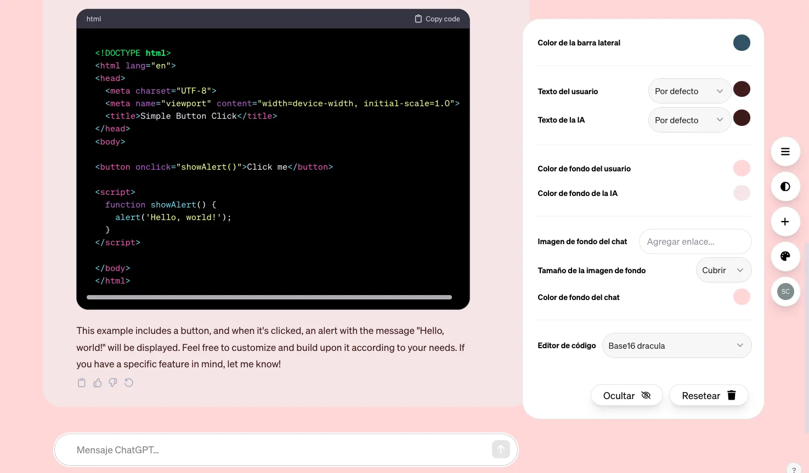

<!-- PIGEONPOSSE START MARK -->
<!--

██████╗ ██╗ ██████╗ ███████╗ ██████╗ ███╗   ██╗                     
██╔══██╗██║██╔════╝ ██╔════╝██╔═══██╗████╗  ██║                     
██████╔╝██║██║  ███╗█████╗  ██║   ██║██╔██╗ ██║                     
██╔═══╝ ██║██║   ██║██╔══╝  ██║   ██║██║╚██╗██║                     
██║     ██║╚██████╔╝███████╗╚██████╔╝██║ ╚████║                     
╚═╝     ╚═╝ ╚═════╝ ╚══════╝ ╚═════╝ ╚═╝  ╚═══╝                     
                                                                    
██████╗  ██████╗ ███████╗███████╗███████╗                           
██╔══██╗██╔═══██╗██╔════╝██╔════╝██╔════╝                           
██████╔╝██║   ██║███████╗███████╗█████╗                             
██╔═══╝ ██║   ██║╚════██║╚════██║██╔══╝                             
██║     ╚██████╔╝███████║███████║███████╗                           
╚═╝      ╚═════╝ ╚══════╝╚══════╝╚══════╝                           
                                                                                                                                        
                                                                    
█████╗█████╗█████╗█████╗█████╗█████╗█████╗█████╗                    
╚════╝╚════╝╚════╝╚════╝╚════╝╚════╝╚════╝╚════╝                    
                                                                                                                                        
                                                                    
███████╗████████╗██╗   ██╗██╗     ███████╗ ██████╗ ██████╗ ████████╗
██╔════╝╚══██╔══╝╚██╗ ██╔╝██║     ██╔════╝██╔════╝ ██╔══██╗╚══██╔══╝
███████╗   ██║    ╚████╔╝ ██║     █████╗  ██║  ███╗██████╔╝   ██║   
╚════██║   ██║     ╚██╔╝  ██║     ██╔══╝  ██║   ██║██╔═══╝    ██║   
███████║   ██║      ██║   ███████╗███████╗╚██████╔╝██║        ██║   
╚══════╝   ╚═╝      ╚═╝   ╚══════╝╚══════╝ ╚═════╝ ╚═╝        ╚═╝                        
                                                
VERSION: 	1.4.1 
REPOSITORY: https://github.com/pigeonposse/stylegpt
AUTHORS: 
	- Angelo (https://github.com/angelespejo)
	- Alejo (https://github.com/alejomalia)

DEVELOPED BY PIGEONPOSSE 🐦🌈

-->
<!-- PIGEONPOSSE END MARK -->

# styleGPT -  A _Browser extension_ for ChatGPT

<!-- PIGEONPOSSE START HEADER -->

🤖🧩 StyleGPT is an extension that will provide you with tools to customize the appearance of ChatGPT according to your preferences. 🐦🌈

> [!IMPORTANT]  
> Due to numerous changes on the ChatGPT web platform, StyleGPT will be archived until further notice. This means its functionality will be disabled to prevent future incompatibilities. If you wish, you can uninstall the extension.

Discover the aesthetic evolution with styleGPT, the extension that redefines the appearance of ChatGPT. 🚀 Immerse yourself in a unique experience by blending elegance and functionality in every interaction. Explore the magic of artificial intelligence through an interface that transcends the ordinary. Illuminate your conversations and elevate your interaction with ChatGPT to a new aesthetic level. ✨💬 Join the revolution of the user experience with styleGPT and experience an unparalleled visual standard.✨💻🌈

[View demo](https://www.youtube.com/watch?v=Nh1DvI3p0p8)

Updated functions:

- ✅ Improved interface.
- ✅ Interactive menu.
- ✅ Hide/show menu button.
- ✅ Dark mode button.
- ✅ New chat button.
- ✅ Customize chat menu.
- ✅ Color, text and background choice options for user or AI.
- ✅ Change styles to the code editor
- ✅ Change styles to sidebar

## 🧩 Download

### Browser stores

### Manual Installation Links

[-grey?style=for-the-badge&logo=googlechrome&logoColor=white)](https://github.com/pigeonposse/stylegpt/releases/download/1.4.1/chromium-mv2-stylegpt-1.4.1.zip)

<!-- PIGEONPOSSE END HEADER -->

## ⚙️ Usage

1. Go to _<https://chatgpt.com/>_
2. You will see a right menu on page

|  |  |
| ------------------------- | ------------------------- |

### Demo

> ℹ️ Video demo for v1.3

### Change chat styles

<!--  -->

### Hide/Show Sidebar

### New chat button

### Dark mode button

<!-- PIGEONPOSSE START ORG -->

## 👨‍💻 Development

You can contribute via **_Github_**.

## ☕ Donate

Help us to develop more interesting things.

## 📜 License

This software is licensed with **[GPLv3](/LICENSE)**.

## 🐦 About us

_PigeonPosse_ is a ✨ **code development collective** ✨ focused on creating practical and interesting tools that help developers and users enjoy a more agile and comfortable experience. Our projects cover various programming sectors and we do not have a thematic limitation in terms of projects.

### Collaborators

|                                                                                    | Name        | Role         | GitHub                                         |
| ---------------------------------------------------------------------------------- | ----------- | ------------ | ---------------------------------------------- |
|  | Angelo |   Author & Development   | [@Angelo](https://github.com/angelespejo) |
|  | Alejo |   Author & Design   | [@Alejo](https://github.com/alejomalia) |
|  | PigeonPosse | Collective | [@PigeonPosse](https://github.com/PigeonPosse) |

 

<!-- PIGEONPOSSE END ORG -->
