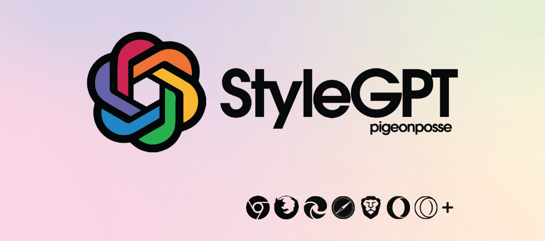

<!-- PIGEONPOSSE START MARK -->
<!--

██████╗ ██╗ ██████╗ ███████╗ ██████╗ ███╗   ██╗                     
██╔══██╗██║██╔════╝ ██╔════╝██╔═══██╗████╗  ██║                     
██████╔╝██║██║  ███╗█████╗  ██║   ██║██╔██╗ ██║                     
██╔═══╝ ██║██║   ██║██╔══╝  ██║   ██║██║╚██╗██║                     
██║     ██║╚██████╔╝███████╗╚██████╔╝██║ ╚████║                     
╚═╝     ╚═╝ ╚═════╝ ╚══════╝ ╚═════╝ ╚═╝  ╚═══╝                     
                                                                    
██████╗  ██████╗ ███████╗███████╗███████╗                           
██╔══██╗██╔═══██╗██╔════╝██╔════╝██╔════╝                           
██████╔╝██║   ██║███████╗███████╗█████╗                             
██╔═══╝ ██║   ██║╚════██║╚════██║██╔══╝                             
██║     ╚██████╔╝███████║███████║███████╗                           
╚═╝      ╚═════╝ ╚══════╝╚══════╝╚══════╝                           
                                                                                                                                        
                                                                    
█████╗█████╗█████╗█████╗█████╗█████╗█████╗█████╗                    
╚════╝╚════╝╚════╝╚════╝╚════╝╚════╝╚════╝╚════╝                    
                                                                                                                                        
                                                                    
███████╗████████╗██╗   ██╗██╗     ███████╗ ██████╗ ██████╗ ████████╗
██╔════╝╚══██╔══╝╚██╗ ██╔╝██║     ██╔════╝██╔════╝ ██╔══██╗╚══██╔══╝
███████╗   ██║    ╚████╔╝ ██║     █████╗  ██║  ███╗██████╔╝   ██║   
╚════██║   ██║     ╚██╔╝  ██║     ██╔══╝  ██║   ██║██╔═══╝    ██║   
███████║   ██║      ██║   ███████╗███████╗╚██████╔╝██║        ██║   
╚══════╝   ╚═╝      ╚═╝   ╚══════╝╚══════╝ ╚═════╝ ╚═╝        ╚═╝                        
                                                
VERSION: 	1.3.0 
REPOSITORY: https://github.com/pigeonposse/stylegpt
AUTHORS: 
	- Angelo (https://github.com/angelespejo)
	- Alejo (https://github.com/alejomalia)

DEVELOPED BY PIGEONPOSSE 🐦🌈

-->
<!-- PIGEONPOSSE END MARK -->

# styleGPT -  A _Browser extension_ for ChatGPT

<!-- PIGEONPOSSE START HEADER -->

StyleGPT is an extension that modifies the appearance of ChatGPT, providing a more beautiful and novel interface for users. Thanks to this extension, you can hide the menu of options and history to give more priority to the conversation, and have quick access to the options and new tools that we have implemented in order to improve the experience.

[View demo](https://www.youtube.com/watch?v=Nh1DvI3p0p8)

## 🧩 Download links

- 
- 

<!-- PIGEONPOSSE END HEADER -->

## ⚙️ Usage

1. Go to _<https://chat.openai.com/>_
2. You will see a right menu on page

|  |  |
| ------------------------- | ------------------------- |

### Demo v1

> ℹ️ Video demo for v1.3

### Change chat styles

<!--  -->

### Hide/Show Sidebar

### New chat button

### Dark mode button

<!-- PIGEONPOSSE START ORG -->

## 👨‍💻 Development

You can contribute via **_Github_**.

## ☕ Donate

Help us to develop more interesting things.

## 📜 License

This software is licensed with **[GPLv3](/LICENSE)**.

## 🐦 About us

_PigeonPosse_ is a ✨ **code development collective** ✨ focused on creating practical and interesting tools that help developers and users enjoy a more agile and comfortable experience. Our projects cover various programming sectors and we do not have a thematic limitation in terms of projects.

### Collaborators

|                                                                                    | Name        | Role         | GitHub                                         |
| ---------------------------------------------------------------------------------- | ----------- | ------------ | ---------------------------------------------- |
|  | Angelo |   Author & Development   | [@Angelo](https://github.com/angelespejo) |
|  | Alejo |   Author & Design   | [@Alejo](https://github.com/alejomalia) |
|  | PigeonPosse | Collective | [@PigeonPosse](https://github.com/PigeonPosse) |

 

<!-- PIGEONPOSSE END ORG -->
