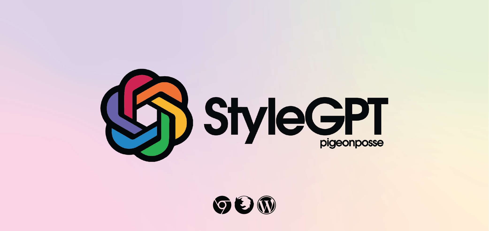
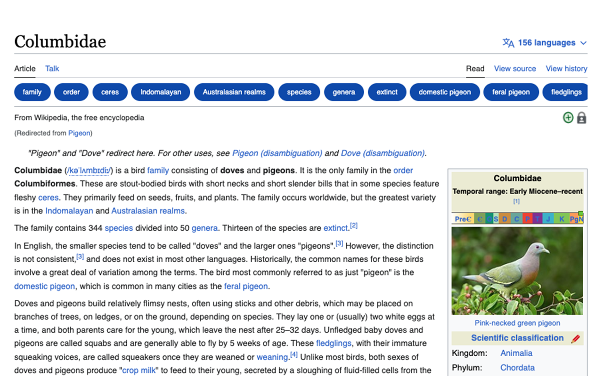
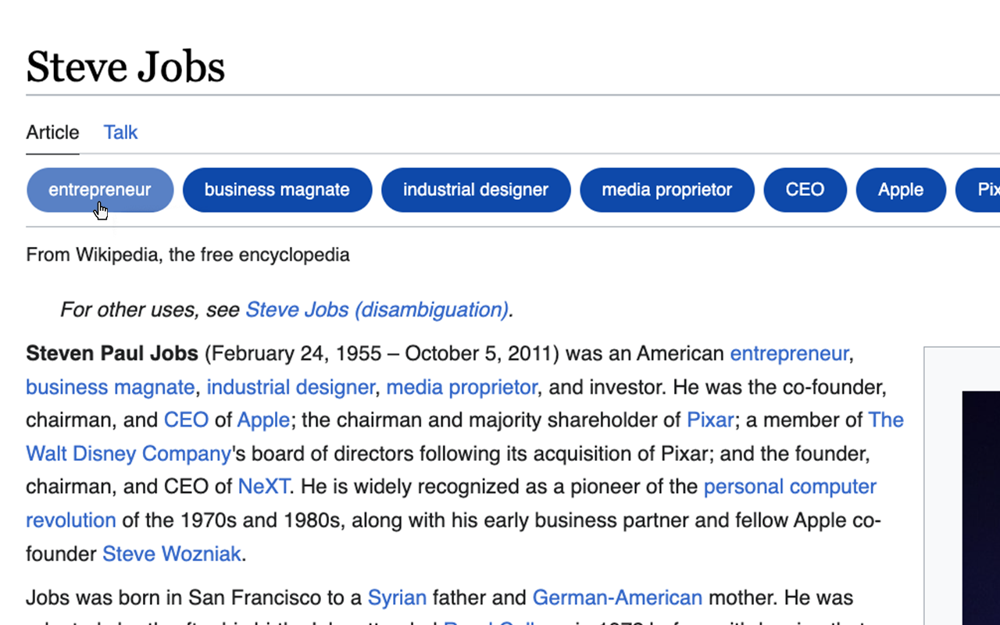
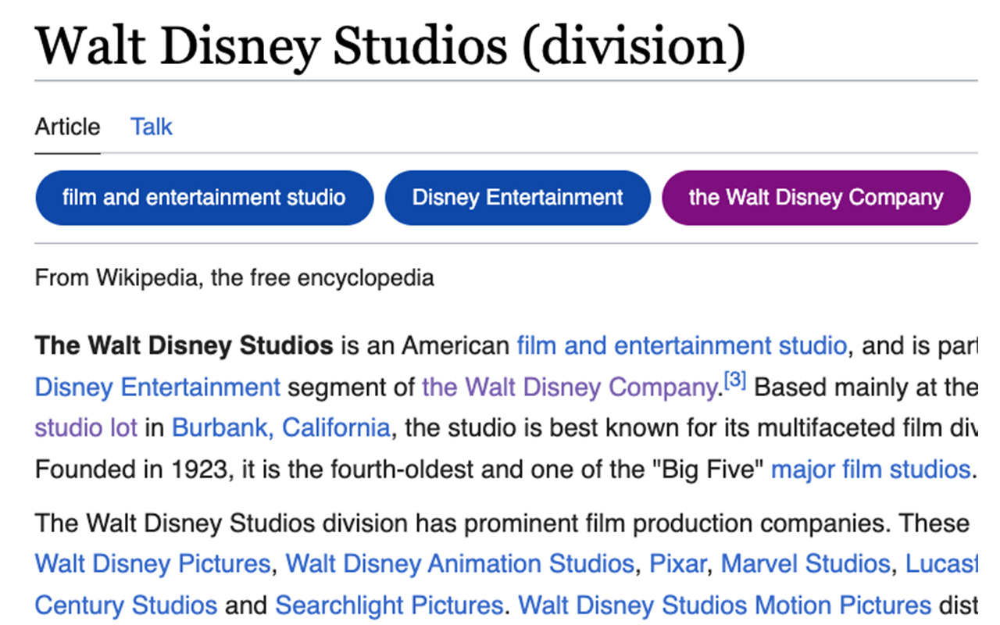

<!--

██████╗ ██╗ ██████╗ ███████╗ ██████╗ ███╗   ██╗                     
██╔══██╗██║██╔════╝ ██╔════╝██╔═══██╗████╗  ██║                     
██████╔╝██║██║  ███╗█████╗  ██║   ██║██╔██╗ ██║                     
██╔═══╝ ██║██║   ██║██╔══╝  ██║   ██║██║╚██╗██║                     
██║     ██║╚██████╔╝███████╗╚██████╔╝██║ ╚████║                     
╚═╝     ╚═╝ ╚═════╝ ╚══════╝ ╚═════╝ ╚═╝  ╚═══╝                     
                                                                    
██████╗  ██████╗ ███████╗███████╗███████╗                           
██╔══██╗██╔═══██╗██╔════╝██╔════╝██╔════╝                           
██████╔╝██║   ██║███████╗███████╗█████╗                             
██╔═══╝ ██║   ██║╚════██║╚════██║██╔══╝                             
██║     ╚██████╔╝███████║███████║███████╗                           
╚═╝      ╚═════╝ ╚══════╝╚══════╝╚══════╝                           
                                                                                                                                        
                                                                    
█████╗█████╗█████╗█████╗█████╗█████╗█████╗█████╗                    
╚════╝╚════╝╚════╝╚════╝╚════╝╚════╝╚════╝╚════╝                    
                                                                                                                                        
                                                                    
███████╗████████╗██╗   ██╗██╗     ███████╗ ██████╗ ██████╗ ████████╗
██╔════╝╚══██╔══╝╚██╗ ██╔╝██║     ██╔════╝██╔════╝ ██╔══██╗╚══██╔══╝
███████╗   ██║    ╚████╔╝ ██║     █████╗  ██║  ███╗██████╔╝   ██║   
╚════██║   ██║     ╚██╔╝  ██║     ██╔══╝  ██║   ██║██╔═══╝    ██║   
███████║   ██║      ██║   ███████╗███████╗╚██████╔╝██║        ██║   
╚══════╝   ╚═╝      ╚═╝   ╚══════╝╚══════╝ ╚═════╝ ╚═╝        ╚═╝   

CREATED BY ANGELO & ALEJO
DEVELOPED BY PIGEONPOSSE

 -->

# styleGPT _Browser extension_

<!-- 

|  |  |
| ------------------------- | ------------------------- | -->

🧩 Download links:

- 
- 

## 👨‍💻 Development

You can contribute via **_Github_**.

## ☕ Donate

Help us to develop more interesting things.

## 📜 License

This software is licensed with GPLv3 (GNU GENERAL PUBLIC LICENSE Version 3).

## 🐦 About us

_PigeonPosse_ is a ✨ **code development collective** ✨ focused on creating practical and interesting tools that help developers and users enjoy a more agile and comfortable experience. Our projects cover various programming sectors and we do not have a thematic limitation in terms of projects.

### Collaborators

|                                                                                    | Name        | Role         | GitHub                                         |
| ---------------------------------------------------------------------------------- | ----------- | ------------ | ---------------------------------------------- |
|  | AngelEspejo | Author & Development      | [@AngelEspejo](https://github.com/AngelEspejo) |
|  	 | Alejo      | Author & Design      | [@AlejoMalia](https://github.com/AlejoMalia) |
|  | PigeonPosse | Collective	  | [@PigeonPosse](https://github.com/PigeonPosse) |

 
